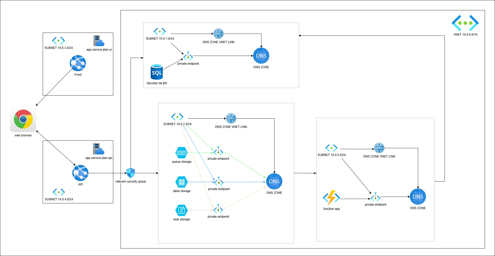

# Proyecto SISCONT

## Diagrama de la arquitectura

---

## Video del Proyecto

###  https://youtu.be/IqhJU4-6-no 

## Descripción del Proyecto

Este proyecto tiene como objetivo el desarrollo y despliegue de la infraestructura en **Azure** para un sistema contable basado en la nube utilizando **Terraform**. Incluye la implementación de **App Service Plans**, **base de datos SQL**, **cuentas de almacenamiento**, **redes virtuales** y otros servicios esenciales para el funcionamiento del sistema.

El sistema contable se despliega en la nube de **Azure** mediante scripts de Terraform, automatizando la creación y configuración de la infraestructura para asegurar escalabilidad, seguridad y alta disponibilidad.

### Componentes Principales

#### 1. **App Service Plan**
Los **App Service Plans** permiten alojar aplicaciones web escalables y seguras. Se han configurado para el despliegue del sistema contable, permitiendo ajustar los recursos según la demanda del sistema.

- **Características clave**:
  - Escalabilidad automática basada en el tráfico de la aplicación.
  - Despliegue de múltiples instancias para garantizar alta disponibilidad.

#### 2. **Base de Datos Azure SQL**
Se ha configurado una base de datos en **Azure SQL** para almacenar todos los registros contables de manera segura y eficiente.

#### 3. **Redes Virtuales y Subnets**
Se ha implementado una **VNet** con subredes para asegurar la comunicación interna entre los diferentes componentes de la infraestructura, como la base de datos, las aplicaciones web, los recursos de almacenamiento y las funciones de aplicación.

#### 4. **Almacenamiento de Azure (Blob, Queue y Table Storage)**
Se han implementado diferentes tipos de almacenamiento en **Azure** para manejar diferentes funcionalidades del sistema:
- **Blob Storage** para almacenamiento de documentos y archivos de respaldo.
- **Queue Storage** para gestionar solicitudes asíncronas entre diferentes componentes del sistema.
- **Table Storage** para almacenar información estructurada de forma eficiente.

#### 5. **Endpoints Privados y DNS Privado**
Se han configurado **endpoints privados** para garantizar que las comunicaciones entre los servicios se realicen de forma segura dentro de la red privada de Azure, evitando la exposición a internet.

- **DNS Privado**:
  - Configurado para cada servicio (Blob, Queue, Table), asegurando que todas las llamadas se resuelvan dentro de la red privada.

## Arquitectura General

El diagrama de arquitectura muestra la relación entre los diferentes componentes, el flujo de datos entre ellos y cómo interactúan:

- **App Service**: Desplegado en el App Service Plan y conectado a la base de datos y almacenamiento.
- **VNet/Subnet**: Red virtual que conecta todos los recursos de la infraestructura.
- **Azure SQL**: Base de datos principal, conectada al servicio web mediante la VNet.
- **Almacenamiento**: Múltiples contenedores y tablas de almacenamiento para datos estructurados y archivos.

## Infraestructura como Código (IaC)
El despliegue se realiza con **Terraform**, lo que permite:
- **Automatización completa** del despliegue y gestión de la infraestructura.
- **Reutilización** y parametrización del código mediante variables y módulos.

## Resumen de Infraestructura

Este proyecto de Terraform ha automatizado el despliegue de la infraestructura para un sistema contable basado en Azure, asegurando que el sistema sea:
- **Escalable**: Capaz de ajustarse automáticamente según la demanda.
- **Seguro**: Con redes privadas y seguridad a nivel de recursos.
- **Rentable**:  Utilizando soluciones basadas en el consumo para optimizar costos operativos.